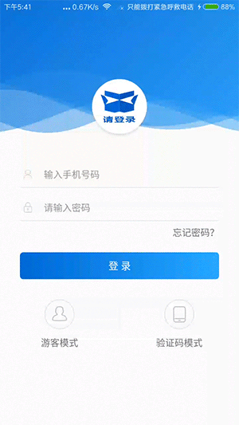
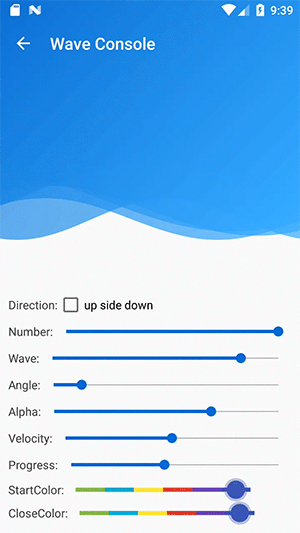
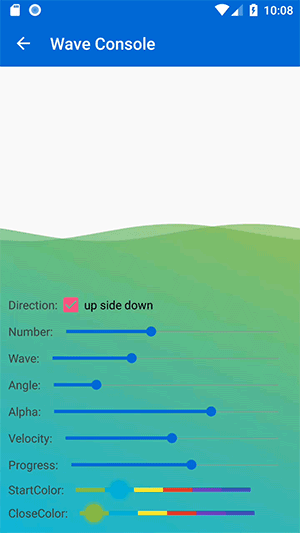
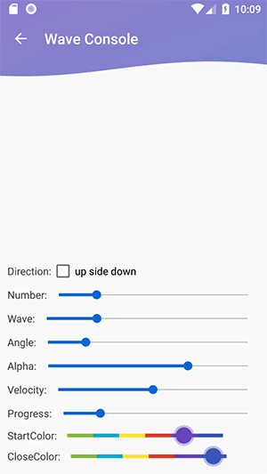

# Android 炫酷的多重水波纹 MultiWaveHeader

自去年第一次发布开源库[SmartRefreshLayout](https://github.com/scwang90/SmartRefreshLayout)以来，深刻的感受到了开源的乐趣。
所以打算以后开发过程中把一些自己实现的实用开源库也开源出来，供大家使用、讨论、升级。
MultiWaveHeader 便是第二个发布的开源库！先来看看下面的展示效果吧。

## Demo



[Download APK-Demo](app-debug.apk)

## 特性

MultiWaveHeader 是一个可以高度定制每一条水波、且随意增加水波数量的 Android 水波开源库。
从而可以通过使用者自己的创意定制，可以使用在不同的页面场景。
目前 github 能搜索到的比较流行的水波开源库，如：[tangqi92/WaveLoadingView](https://github.com/tangqi92/WaveLoadingView)、[john990/WaveView](https://github.com/john990/WaveView)、[gelitenight/WaveView](https://github.com/gelitenight/WaveView) 等目前看起来对水波本身的可定制程度不高，都是固定两条水波。


## 控制台

### 方向

|顶部|底部|
|:---:|:---:|
||

### 数量

|一对|单一|
|:---:|:---:|
||


## 使用
#### 1.在 build.gradle 中添加依赖
```
compile 'com.scwang.wave:MultiWaveHeader:1.0.0-alpha-1'
```

#### 2.在XML布局文件中添加 MultiWaveHeader
```xml
<com.scwang.wave.MultiWaveHeader
    android:id="@+id/waveHeader"
    android:layout_width="match_parent"
    android:layout_height="200dp">
```

## 属性

#### 可以配置一些基本的属性.

###### java
```java
    MultiWaveHeader waveHeader = findViewById(R.id.waveHeader);

    waveHeader.setStartColor(R.color.colorPrimary);
    waveHeader.setCloseColor(R.color.colorPrimaryDark);
    waveHeader.setColorAlpha(.5f);

    waveHeader.setWaveHeight(50);
    waveHeader.setGradientAngle(360);
    waveHeader.setProgress(.8f);
    waveHeader.setVelocity(1f);
    waveHeader.setScaleY(-1f);

    waveHeader.setWaves("PairWave");

    waveHeader.start();
    waveHeader.stop();
    waveHeader.isRunning();
```

###### xml
```xml
    <com.scwang.wave.MultiWaveHeader
        android:id="@+id/waveHeader"
        android:layout_width="match_parent"
        android:layout_height="200dp"
        android:scaleY="-1"
        app:mwhVelocity="1"
        app:mwhProgress="1"
        app:mwhRunning="true"
        app:mwhGradientAngle="45"
        app:mwhWaveHeight="50dp"
        app:mwhColorAlpha="0.45"
        app:mwhStartColor="@color/colorPrimaryDark"
        app:mwhCloseColor="@color/colorPrimaryLight"
        app:mwhWaves="MultiWave">
```

## 精准定制

MultiWaveHeader 可以精准定制每一条水波的参数：偏移量、拉伸量、运动速度和方向。


###### java
```java
    MultiWaveHeader waveHeader = findViewById(R.id.waveHeader);


    String[] waves = new String[]{
        "70,25,1.4,1.4,-26",//wave-1:offsetX(dp),offsetY(dp),scaleX,scaleY,velocity(dp/s)
        "100,5,1.4,1.2,15",
        "420,0,1.15,1,-10",//wave-3:水平偏移(dp),竖直偏移(dp),水平拉伸,竖直拉伸,速度(dp/s)
        "520,10,1.7,1.5,20",
        "220,0,1,1,-15",
    };
    waveHeader.setWaves(TextUtils.join(" ", Arrays.asList(waves)));// custom
    waveHeader.setWaves("PairWave");// default two waves
    waveHeader.setWaves("MultiWave");// default five waves

```

###### xml
```xml
    <com.scwang.wave.MultiWaveHeader
        android:id="@+id/waveHeader"
        android:layout_width="match_parent"
        android:layout_height="200dp"
        app:mwhWaves="PairWave"
        app:mwhWaves="MultiWave"
        app:mwhWaves="
            70,25,1.4,1.4,-26
            100,5,1.4,1.2,15
            420,0,1.15,1,-10
            520,10,1.7,1.5,20
            220,0,1,1,-15">
```


 
